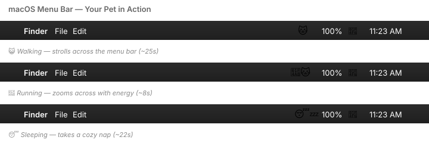

# 🐱 Desktop Pet

A tiny animated cat that lives in your **macOS menu bar** — walks, runs, sleeps, and idles on its own.


## 📺 Preview



> 💡 **Want to add your own screenshot?** Run the app, take a screenshot of your menu bar with `⌘ + Shift + 4`, save it as `assets/screenshot.png`, and reference it here.

## ✨ Features

- 🐈 Animated cat in your menu bar
- 😴 Auto-transitions between **walk**, **run**, **sleep**, and **idle** states
- 🎛️ Manual override via menu click
- 🪶 Lightweight — single Python file, ~80 lines

## 🚀 Quick Start

> **Requires:** Python 3.8+ on macOS

```bash
# 1. Clone the repo
git clone https://github.com/bhavishapatel209/desktop-pet.git
cd desktop-pet

# 2. Create a virtual environment & install rumps
python3 -m venv venv
./venv/bin/pip install -r requirements.txt

# 3. Run it
./venv/bin/python desktop_pet.py
```

Your cat will appear in the menu bar. Click it to control state or quit.

<details>
<summary><b>Why a virtual environment?</b></summary>

Modern macOS (with Homebrew Python) blocks system-wide `pip install` via [PEP 668](https://peps.python.org/pep-0668/) to prevent breaking your system. A virtual environment (`venv/`) keeps the project's dependencies isolated and avoids that error.

Prefer to activate the venv once and just type `python`?

```bash
source venv/bin/activate
python desktop_pet.py
```

</details>

## 🎬 States

| State | Animation | Avg. Duration |
|---|---|---|
| 😺 Walk | `🐱 → 🐱 → 🐱` | ~25s |
| 💨 Run | `🐱💨 → 💨🐱` | ~8s |
| 😴 Sleep | `😴 → 💤 → 😴 z` | ~22s |
| 😼 Idle | `🐱 → 😺 → 😼` | ~10s |

## 🛠️ Customization

Open `desktop_pet.py` and edit:

- `FRAMES` — animation frames per state
- `STATE_DURATION` — how long each state lasts (in seconds)
- `TRANSITIONS` — weighted next-state probabilities
- `TICK` — animation speed (lower = faster)

## 📦 Make it a Standalone App (Optional)

To run it as a real `.app` that auto-starts at login:

```bash
./venv/bin/pip install py2app
./venv/bin/py2applet --make-setup desktop_pet.py
./venv/bin/python setup.py py2app
```

The packaged `.app` will be in `dist/`. Drag it to `/Applications` and add it to **System Settings → General → Login Items** to auto-start on boot.

## 📄 License

MIT
